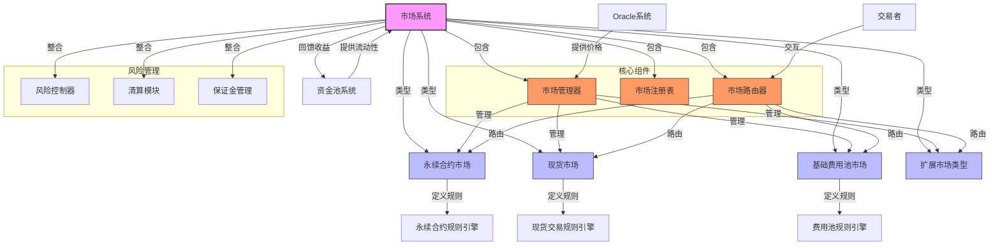

import { Callout, Cards, FileTree, Steps, Tabs } from 'nextra/components'

# Triplex 市场系统

<Callout type="info">
  Triplex 的市场系统是一个模块化、可扩展的架构，支持多种衍生品市场类型，包括永续合约、现货交易和二元期权等。每个市场模块都建立在核心协议之上，共享相同的抵押品管理和风险评估基础设施。
</Callout>

## 市场类型

<Cards>
  <Cards.Card title="永续合约市场" href="#永续合约市场">
    无到期日的衍生品交易
  </Cards.Card>
  <Cards.Card title="现货市场" href="#现货市场">
    即时结算的资产交易
  </Cards.Card>
  <Cards.Card title="基础费用池市场" href="#基础费用池市场">
    流动性费用的收集与分配
  </Cards.Card>
  <Cards.Card title="扩展市场" href="#扩展市场">
    创新市场模型与交易类型
  </Cards.Card>
</Cards>

## 系统架构

### 市场系统架构图



<FileTree>
  <FileTree.Folder name="Market System" defaultOpen>
    <FileTree.Folder name="Core Components" defaultOpen>
      <FileTree.File name="MarketManager.sol" />
      <FileTree.File name="MarketRegistry.sol" />
      <FileTree.File name="MarketRouter.sol" />
    </FileTree.Folder>
    <FileTree.Folder name="Market Types">
      <FileTree.File name="PerpetualMarket.sol" />
      <FileTree.File name="SpotMarket.sol" />
      <FileTree.File name="BaseFeeMarket.sol" />
    </FileTree.Folder>
    <FileTree.Folder name="Integration">
      <FileTree.File name="OracleConnector.sol" />
      <FileTree.File name="PoolIntegration.sol" />
      <FileTree.File name="LiquidationModule.sol" />
    </FileTree.Folder>
  </FileTree.Folder>
</FileTree>

## 永续合约市场

<Tabs items={['功能特点', '交易机制', '风险控制']}>
  <Tabs.Tab>
    <Cards>
      <Cards.Card title="杠杆交易" href="#杠杆交易">
        杠杆率设置与风险控制
      </Cards.Card>
      <Cards.Card title="资金费率" href="#资金费率">
        多周期费率与市场平衡
      </Cards.Card>
      <Cards.Card title="持仓管理" href="#持仓管理">
        仓位跟踪与限额控制
      </Cards.Card>
      <Cards.Card title="订单执行" href="#订单执行">
        多样化订单类型支持
      </Cards.Card>
    </Cards>
  </Tabs.Tab>
  
  <Tabs.Tab>
    <Steps>
      1. **开仓流程**
         - 验证保证金
         - 计算杠杆率
         - 执行开仓
      
      2. **持仓维护**
         - 计算资金费率
         - 更新持仓状态
         - 监控风险指标
      
      3. **平仓结算**
         - 计算盈亏
         - 处理手续费
         - 更新系统状态
    </Steps>
  </Tabs.Tab>
  
  <Tabs.Tab>
    <Cards>
      <Cards.Card title="保证金要求" href="#保证金要求">
        动态保证金与风险评估
      </Cards.Card>
      <Cards.Card title="清算机制" href="#清算机制">
        多级清算流程与激励
      </Cards.Card>
      <Cards.Card title="风险限额" href="#风险限额">
        基于账户与市场的限制
      </Cards.Card>
      <Cards.Card title="价格保护" href="#价格保护">
        防操纵与异常监控
      </Cards.Card>
    </Cards>
  </Tabs.Tab>
</Tabs>

## 现货市场

<Callout type="warning">
  现货市场采用原子订单模块，确保交易的即时性和价格发现的准确性。
</Callout>

### 交易机制

<Steps>
  1. **订单创建**
     - 验证交易对
     - 检查流动性
     - 计算滑点
  
  2. **价格发现**
     - 获取预言机价格
     - 计算成交价格
     - 验证价格偏差
  
  3. **订单执行**
     - 资产转移
     - 更新流动性
     - 收取手续费
</Steps>

### 流动性管理

<Cards>
  <Cards.Card title="流动性提供" href="#流动性提供">
    多层流动性与激励机制
  </Cards.Card>
  <Cards.Card title="价格影响" href="#价格影响">
    交易深度与滑点控制
  </Cards.Card>
  <Cards.Card title="费用结构" href="#费用结构">
    交易费与LP奖励设计
  </Cards.Card>
  <Cards.Card title="激励机制" href="#激励机制">
    流动性挖矿与奖励分配
  </Cards.Card>
</Cards>

## 基础费用池市场

<Tabs items={['市场特点', '对冲机制', '数据支持']}>
  <Tabs.Tab>
    <Cards>
      <Cards.Card title="创新设计" href="#创新设计">
        独特市场机制与功能
      </Cards.Card>
      <Cards.Card title="风险管理" href="#风险管理">
        定制化风险控制策略
      </Cards.Card>
      <Cards.Card title="收益模式" href="#收益模式">
        市场特定收益分配
      </Cards.Card>
    </Cards>
  </Tabs.Tab>
  
  <Tabs.Tab>
    <Steps>
      1. **对冲策略**
         - 分析gas趋势
         - 构建对冲头寸
         - 动态调整策略
      
      2. **风险控制**
         - 限制最大敞口
         - 设置触发条件
         - 自动平仓机制
    </Steps>
  </Tabs.Tab>
  
  <Tabs.Tab>
    <Cards>
      <Cards.Card title="数据来源" href="#数据来源">
        市场数据收集与整合
      </Cards.Card>
      <Cards.Card title="预言机" href="#预言机">
        可靠价格数据提供
      </Cards.Card>
      <Cards.Card title="分析工具" href="#分析工具">
        市场活动监控与分析
      </Cards.Card>
    </Cards>
  </Tabs.Tab>
</Tabs>

## 风险管理系统

<Callout type="error">
  市场系统实施全面的风险管理措施，确保系统的安全性和稳定性。
</Callout>

### 风险控制机制

<Steps>
  1. **持仓限制**
     - 单个市场限额
     - 用户持仓上限
     - 系统总限额
  
  2. **偏斜度管理**
     - 监控持仓偏斜
     - 动态调整费率
     - 激励平衡机制
  
  3. **清算程序**
     - 触发条件设定
     - 自动化执行
     - 清算奖励分配
</Steps>

## 治理与参数管理

<Tabs items={['市场治理', '参数调整', '费用管理']}>
  <Tabs.Tab>
    <Cards>
      <Cards.Card title="市场创建" href="#市场创建">
        新市场启动流程与标准
      </Cards.Card>
      <Cards.Card title="规则修改" href="#规则修改">
        市场参数调整机制
      </Cards.Card>
      <Cards.Card title="紧急响应" href="#紧急响应">
        异常情况处理流程
      </Cards.Card>
    </Cards>
  </Tabs.Tab>
  
  <Tabs.Tab>
    <Steps>
      1. **参数评估**
         - 数据分析
         - 风险评估
         - 影响预测
      
      2. **调整流程**
         - 提案创建
         - 社区讨论
         - 实施更新
    </Steps>
  </Tabs.Tab>
  
  <Tabs.Tab>
    <Cards>
      <Cards.Card title="费用结构" href="#费用结构">
        市场费用设计与分类
      </Cards.Card>
      <Cards.Card title="分配机制" href="#分配机制">
        收益在系统各方间分配
      </Cards.Card>
      <Cards.Card title="调整策略" href="#调整策略">
        费用动态调整与优化
      </Cards.Card>
    </Cards>
  </Tabs.Tab>
</Tabs>

## 技术实现

<Callout type="info">
  市场模块通过标准化接口与核心协议交互，确保系统的可扩展性和模块化。
</Callout>

### 接口定义

```solidity
interface IMarketModule {
    function registerMarket(uint128 requestedMarketId) external;
    function reportLiquidation(uint128 marketId, int256 debtChange) external;
    function updatePrices() external;
    // 更多市场特定功能...
}
```

### 系统集成

<Steps>
  1. **核心协议集成**
     - 信用额度管理
     - 头寸报告机制
     - 债务跟踪系统
  
  2. **预言机集成**
     - 价格数据获取
     - 数据验证机制
     - 异常处理流程
  
  3. **流动性池集成**
     - 抵押品管理
     - 风险分配
     - 收益分配
</Steps>
