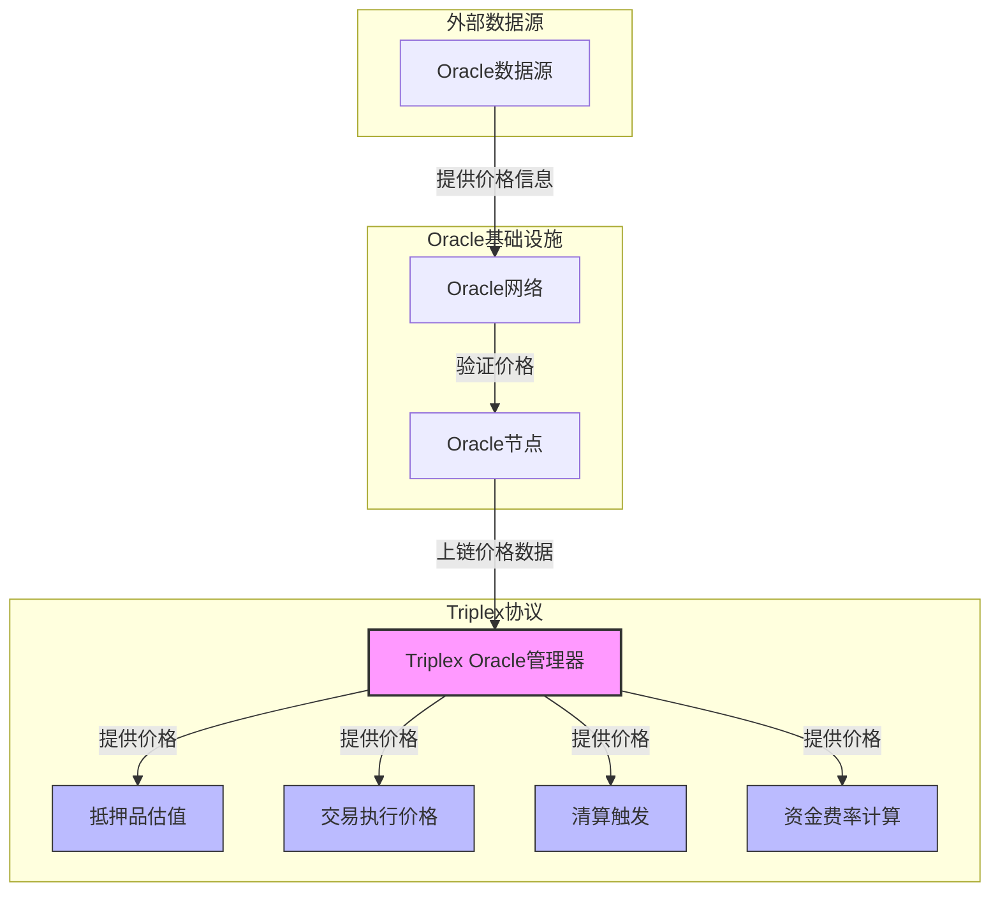
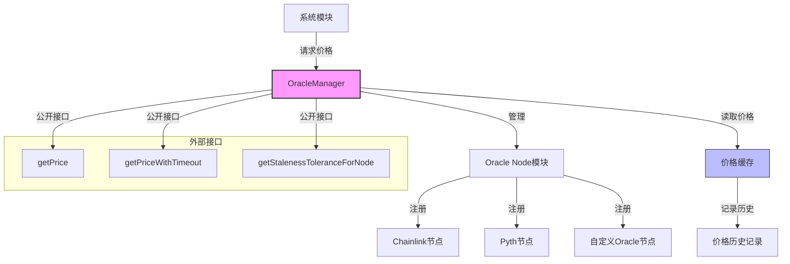
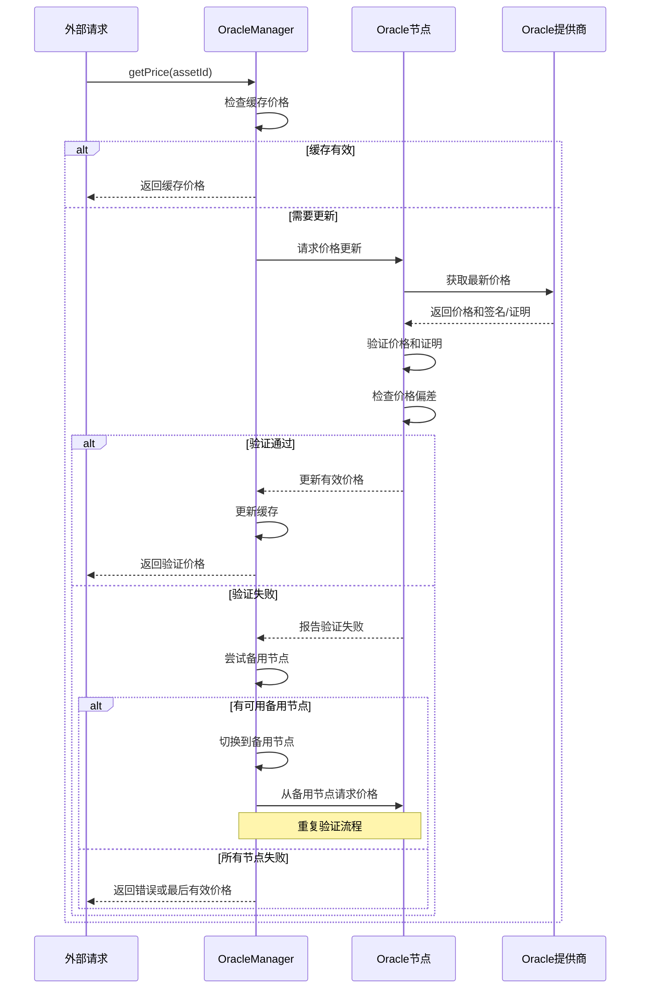

import { Callout, Cards, FileTree, Steps, Tabs } from 'nextra/components'

# Triplex 预言机系统

<Callout type="info">
  预言机系统是 Triplex 的核心基础设施，为协议提供可靠的价格数据。系统采用模块化设计，支持多源数据输入，确保价格数据的准确性和可靠性，为抵押品估值、清算决策、汇率计算等核心功能提供支持。
</Callout>

## 系统架构

### Oracle系统架构图



### 节点架构

<Cards>
  <Cards.Card title="节点类型" href="#节点类型">
    数据源节点、聚合节点、输出节点
  </Cards.Card>
  <Cards.Card title="节点关系" href="#节点关系">
    层次结构与数据流动
  </Cards.Card>
  <Cards.Card title="处理管道" href="#处理管道">
    数据收集、处理、验证流程
  </Cards.Card>
  <Cards.Card title="数据流" href="#数据流">
    从外部到系统的数据传递
  </Cards.Card>
</Cards>

### 模块结构

<FileTree>
  <FileTree.Folder name="Oracle System" defaultOpen>
    <FileTree.Folder name="Core Modules" defaultOpen>
      <FileTree.File name="NodeModule.sol" />
      <FileTree.File name="PriceModule.sol" />
      <FileTree.File name="NodeOutputModule.sol" />
      <FileTree.File name="NodeDefinition.sol" />
    </FileTree.Folder>
    <FileTree.Folder name="Price Feeds">
      <FileTree.File name="ChainlinkFeed.sol" />
      <FileTree.File name="PythFeed.sol" />
      <FileTree.File name="CustomFeed.sol" />
    </FileTree.Folder>
    <FileTree.Folder name="Node Types">
      <FileTree.File name="ExternalNode.sol" />
      <FileTree.File name="ReducerNode.sol" />
      <FileTree.File name="TransformNode.sol" />
      <FileTree.File name="CircuitBreaker.sol" />
    </FileTree.Folder>
  </FileTree.Folder>
</FileTree>

## Oracle Manager

### Oracle Manager 架构



<Tabs items={['配置管理', '数据处理', '安全机制']}>
  <Tabs.Tab>
    ```solidity
    interface IOracleManager {
        function registerNode(
            NodeDefinition memory node,
            bytes memory parameters
        ) external returns (uint nodeId);
        
        function configureNode(
            uint nodeId,
            bytes memory parameters
        ) external;
        
        function removeNode(uint nodeId) external;
    }
    ```
  </Tabs.Tab>
  
  <Tabs.Tab>
    <Steps>
      1. **数据获取**
         - 从外部源获取数据
         - 验证数据格式
         - 处理异常情况
      
      2. **数据转换**
         - 标准化处理
         - 数据清洗
         - 格式转换
    </Steps>
  </Tabs.Tab>
  
  <Tabs.Tab>
    <Cards>
      <Cards.Card title="数据验证" href="#数据验证">
        格式验证、范围检查、签名验证
      </Cards.Card>
      <Cards.Card title="异常检测" href="#异常检测">
        偏差分析、异常模式识别
      </Cards.Card>
      <Cards.Card title="应急机制" href="#应急机制">
        安全模式与备用方案
      </Cards.Card>
    </Cards>
  </Tabs.Tab>
</Tabs>

## 价格馈送

### 价格验证流程



### 数据源集成

<Cards>
  <Cards.Card title="Chainlink" href="#chainlink">
    高可靠性、多链支持、广泛应用
  </Cards.Card>
  <Cards.Card title="Pyth" href="#pyth">
    低延迟、高频更新、交叉验证
  </Cards.Card>
  <Cards.Card title="自定义馈送" href="#自定义馈送">
    定制数据源与专用接口
  </Cards.Card>
  <Cards.Card title="跨链数据" href="#跨链数据">
    多链数据整合与同步
  </Cards.Card>
</Cards>

### 节点类型

<Tabs items={['外部馈送', '聚合节点', '转换节点', '熔断节点']}>
  <Tabs.Tab>
    <Steps>
      1. **接口集成**
         - 标准化接口
         - 数据格式转换
         - 错误处理
      
      2. **状态管理**
         - 连接状态监控
         - 数据缓存
         - 重试机制
    </Steps>
  </Tabs.Tab>
  
  <Tabs.Tab>
    <Cards>
      <Cards.Card title="TWAP" href="#twap">
        时间加权平均价格
      </Cards.Card>
      <Cards.Card title="中位数" href="#中位数">
        中间值过滤极端值
      </Cards.Card>
      <Cards.Card title="加权平均" href="#加权平均">
        基于信任度的加权机制
      </Cards.Card>
    </Cards>
  </Tabs.Tab>
  
  <Tabs.Tab>
    <Steps>
      1. **数学运算**
         - 价格转换
         - 单位调整
         - 精度处理
      
      2. **逻辑转换**
         - 条件判断
         - 阈值处理
         - 状态转换
    </Steps>
  </Tabs.Tab>
  
  <Tabs.Tab>
    <Cards>
      <Cards.Card title="价格偏差" href="#价格偏差">
        源间偏差检测与处理
      </Cards.Card>
      <Cards.Card title="数据过期" href="#数据过期">
        更新时效性与处理策略
      </Cards.Card>
      <Cards.Card title="系统故障" href="#系统故障">
        系统级故障响应机制
      </Cards.Card>
    </Cards>
  </Tabs.Tab>
</Tabs>

## 系统集成

### 协议集成

<Steps>
  1. **抵押品管理**
     - 资产估值
     - 抵押率计算
     - 清算触发
  
  2. **市场运作**
     - 交易定价
     - 结算价格
     - 资金费率
  
  3. **风险管理**
     - 风险评估
     - 限额控制
     - 系统监控
</Steps>

### 安全机制

<Tabs items={['数据验证', '熔断机制', '治理控制']}>
  <Tabs.Tab>
    <Steps>
      1. **多源验证**
         - 交叉验证
         - 一致性检查
         - 异常标记
      
      2. **时效性**
         - 数据新鲜度
         - 更新频率
         - 过期处理
    </Steps>
  </Tabs.Tab>
  
  <Tabs.Tab>
    <Cards>
      <Cards.Card title="价格波动" href="#价格波动">
        市场波动性适应策略
      </Cards.Card>
      <Cards.Card title="更新频率" href="#更新频率">
        数据更新与系统负载平衡
      </Cards.Card>
      <Cards.Card title="系统负载" href="#系统负载">
        资源消耗与性能管理
      </Cards.Card>
    </Cards>
  </Tabs.Tab>
  
  <Tabs.Tab>
    <Steps>
      1. **权限管理**
         - 节点配置权限
         - 参数调整权限
         - 紧急操作权限
      
      2. **监督机制**
         - 操作审计
         - 异常报告
         - 干预机制
    </Steps>
  </Tabs.Tab>
</Tabs>

## 用户体验

<Callout type="warning">
  预言机系统对最终用户是透明的，但其可靠性和准确性直接影响用户体验。系统通过多层保护机制确保价格数据的公平性和可靠性。
</Callout>

### 服务保障

<Cards>
  <Cards.Card title="可靠性" href="#可靠性">
    系统稳定性与数据准确性
  </Cards.Card>
  <Cards.Card title="准确性" href="#准确性">
    价格精确度与市场反映
  </Cards.Card>
  <Cards.Card title="公平性" href="#公平性">
    中立、透明与可验证
  </Cards.Card>
  <Cards.Card title="一致性" href="#一致性">
    系统内外数据一致性
  </Cards.Card>
</Cards>

### 性能优化

<Steps>
  1. **响应时间**
     - 数据缓存策略
     - 查询优化
     - 并发处理
  
  2. **资源效率**
     - 存储优化
     - 计算优化
     - 网络优化
  
  3. **成本控制**
     - 更新策略优化
     - 资源使用优化
     - 费用预算控制
</Steps>
