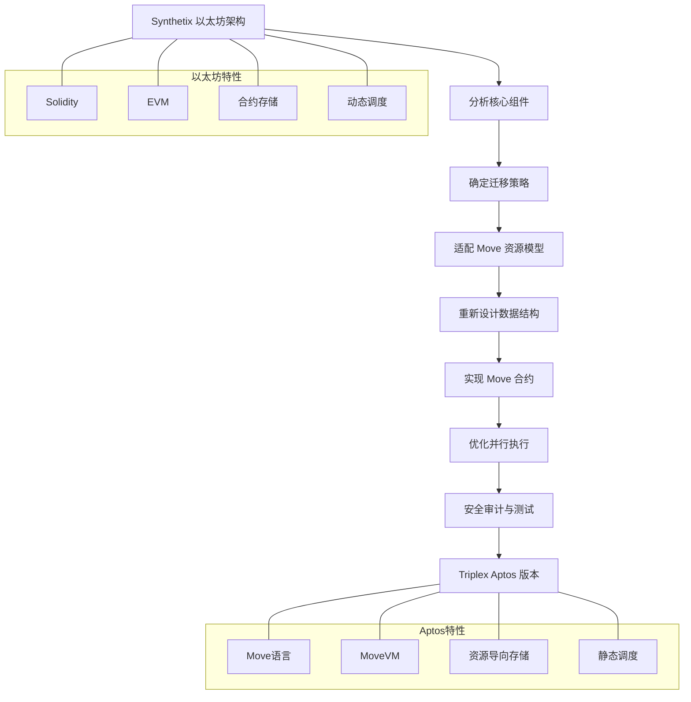
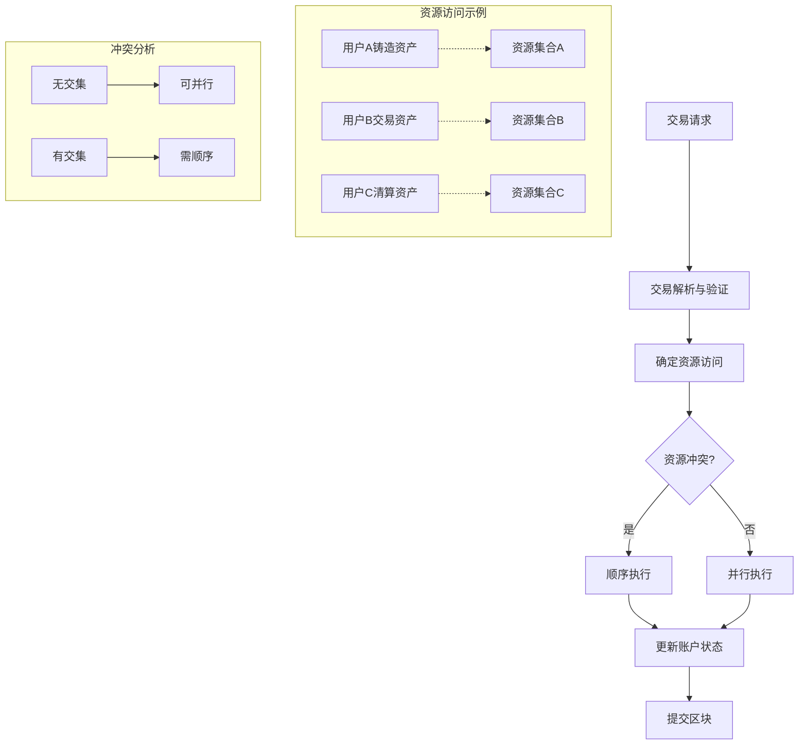

import { Callout, Cards, FileTree, Steps, Tabs } from 'nextra/components'

# Triplex 架构分析

<Callout type="info">
  Triplex 是基于 Synthetix 协议架构迁移到 Aptos 区块链的去中心化金融项目，充分利用 Move 虚拟机的安全特性和性能优势，提供合成资产、永续合约等金融产品。
</Callout>

## 系统组件

<Cards>
  <Cards.Card title="合成资产系统" href="/architecturalanalysis/synthetic">
    基于 Aptos 区块链的合成资产铸造与交易
  </Cards.Card>
  <Cards.Card title="账户系统" href="/architecturalanalysis/accounts">
    利用 Move 资源模型的账户管理
  </Cards.Card>
  <Cards.Card title="核心引擎" href="/architecturalanalysis/core">
    系统核心逻辑与合约
  </Cards.Card>
  <Cards.Card title="治理机制" href="/architecturalanalysis/governance">
    去中心化治理流程
  </Cards.Card>
  <Cards.Card title="市场体系" href="/architecturalanalysis/markets">
    交易市场和价格发现
  </Cards.Card>
  <Cards.Card title="预言机整合" href="/architecturalanalysis/oracle">
    价格数据提供与验证
  </Cards.Card>
  <Cards.Card title="流动性池" href="/architecturalanalysis/pool">
    资源型流动性管理
  </Cards.Card>
  <Cards.Card title="跨链桥接" href="/architecturalanalysis/cross-chain">
    与其他区块链的互操作
  </Cards.Card>
  <Cards.Card title="安全机制" href="/architecturalanalysis/security">
    Move语言安全特性与风险控制
  </Cards.Card>
  <Cards.Card title="性能优化" href="/architecturalanalysis/performance">
    系统性能与扩展性
  </Cards.Card>
  <Cards.Card title="代币经济" href="/architecturalanalysis/tokenomics">
    代币设计与激励机制
  </Cards.Card>
  <Cards.Card title="开发工具" href="/architecturalanalysis/tools">
    接口与开发者工具
  </Cards.Card>
  <Cards.Card title="集成方案" href="/architecturalanalysis/integration">
    与外部系统的集成
  </Cards.Card>
</Cards>

## 从以太坊迁移到 Aptos



## 技术对比

| 特性 | 以太坊 (Synthetix) | Aptos (Triplex) |
|------|-------------------|-----------------|
| **编程语言** | Solidity | Move |
| **虚拟机** | EVM | MoveVM |
| **账户模型** | 外部拥有账户与合约账户 | 统一账户模型 |
| **存储模型** | 合约内状态存储 | 账户内资源存储 |
| **执行模型** | 顺序执行 | 并行执行 |
| **交易费用** | 波动性高 | 更稳定可预测 |
| **安全特性** | 需额外防御 | 内置资源安全 |
| **形式化验证** | 有限支持 | Move Prover 支持 |

## 系统架构

<FileTree>
  <FileTree.Folder name="Triplex System" defaultOpen>
    <FileTree.Folder name="Core Modules">
      <FileTree.File name="synth_core.move" />
      <FileTree.File name="markets.move" />
      <FileTree.File name="staking.move" />
    </FileTree.Folder>
    <FileTree.Folder name="Assets">
      <FileTree.File name="synthetic_assets.move" />
      <FileTree.File name="collateral.move" />
      <FileTree.File name="token.move" />
    </FileTree.Folder>
    <FileTree.Folder name="Governance">
      <FileTree.File name="dao.move" />
      <FileTree.File name="voting.move" />
      <FileTree.File name="treasury.move" />
    </FileTree.Folder>
    <FileTree.Folder name="Integration">
      <FileTree.File name="oracle.move" />
      <FileTree.File name="exchange.move" />
      <FileTree.File name="cross_chain.move" />
    </FileTree.Folder>
  </FileTree.Folder>
</FileTree>

## 主要功能

<Tabs items={['合成资产', '交易市场', '质押机制', '治理系统']}>
  <Tabs.Tab>
    <Steps>
      1. **铸造合成资产**
         - 存入抵押品资源
         - 基于价格数据铸造合成资产
         - 管理抵押率和健康因子
      
      2. **管理合成头寸**
         - 调整抵押品比例
         - 切换抵押品类型
         - 清算风险管理
      
      3. **合成资产类型**
         - 稳定币（tUSD）
         - 加密资产（tBTC、tETH等）
         - 传统资产（股票、商品）
    </Steps>
  </Tabs.Tab>
  
  <Tabs.Tab>
    <Cards>
      <Cards.Card title="现货交易" href="/architecturalanalysis/markets">
        合成资产直接交易
      </Cards.Card>
      <Cards.Card title="永续合约" href="/architecturalanalysis/markets">
        杠杆化衍生品交易
      </Cards.Card>
      <Cards.Card title="做市商系统" href="/architecturalanalysis/markets">
        提供流动性获取收益
      </Cards.Card>
      <Cards.Card title="订单簿" href="/architecturalanalysis/markets">
        高效匹配交易订单
      </Cards.Card>
    </Cards>
  </Tabs.Tab>
  
  <Tabs.Tab>
    ```move
    module triplex::staking {
        use std::signer;
        use aptos_framework::coin;
        use aptos_framework::timestamp;
        
        struct StakePosition has key {
            amount: u64,
            start_time: u64,
            last_claim: u64,
            unclaimed_rewards: u64,
        }
        
        struct StakingConfig has key {
            reward_rate: u64,
            min_lock_period: u64,
            early_exit_penalty: u64,
        }
        
        public fun stake(account: &signer, amount: u64) {
            // 质押实现逻辑
        }
        
        public fun unstake(account: &signer, amount: u64): u64 {
            // 解除质押逻辑
        }
        
        public fun claim_rewards(account: &signer): u64 {
            // 领取奖励逻辑
        }
    }
    ```
  </Tabs.Tab>
  
  <Tabs.Tab>
    <Callout type="info">
      Triplex 采用去中心化自治组织(DAO)模式进行治理，持有XPL代币的用户可以参与提案投票，决定系统参数、费用分配和升级方案。
    </Callout>
    
    <Steps>
      1. **提案流程**
         - 创建治理提案
         - 社区讨论期
         - 投票表决
         - 实施执行
      
      2. **投票权重**
         - 基于代币持有量
         - 考虑质押时长
         - 代表机制
      
      3. **多签名执行**
         - 关键参数变更
         - 紧急操作授权
         - 升级控制
    </Steps>
  </Tabs.Tab>
</Tabs>

## 安全考虑

<Callout type="warning">
  Triplex 系统利用 Move 语言的资源模型和形式化验证优势，提供更高安全性保障，同时实施多层风险控制措施。
</Callout>

### 安全机制

<Cards>
  <Cards.Card title="资源安全" href="/architecturalanalysis/security">
    Move 资源不可复制、不可丢失
  </Cards.Card>
  <Cards.Card title="形式化验证" href="/architecturalanalysis/security">
    Move Prover 数学证明
  </Cards.Card>
  <Cards.Card title="权限控制" href="/architecturalanalysis/security">
    细粒度访问管理
  </Cards.Card>
  <Cards.Card title="紧急响应" href="/architecturalanalysis/security">
    风险监控与应急机制
  </Cards.Card>
</Cards>

## 性能优化

### 并行执行模型



### 性能指标

| 指标 | 以太坊 | Aptos | Triplex优化后 |
|------|--------|-------|---------------|
| **TPS** | ~15 | ~4,000 | ~10,000 |
| **确认时间** | 分钟级 | 秒级 | 亚秒级 |
| **Gas成本** | 高且波动 | 低且稳定 | 进一步优化 |
| **状态访问** | 全局 | 分区并行 | 细粒度分区 |
