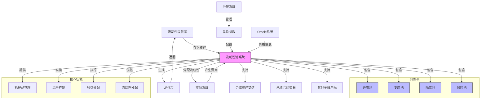

import { Callout, Cards, FileTree, Steps, Tabs } from 'nextra/components'

# Triplex 流动性池系统

<Callout type="info">
  Triplex 的流动性池系统是合成资产和衍生品市场的基础支撑，提供抵押品管理、风险承担和收益分配等核心功能。系统采用多池架构，支持不同风险偏好和市场需求。
</Callout>

## 系统架构

### 流动性池系统架构图

<Cards>
  <Cards.Card title="通用池" href="#通用池">
    接受多种抵押品，支持多种市场类型
  </Cards.Card>
  <Cards.Card title="专用池" href="#专用池">
    专注特定资产类别和市场
  </Cards.Card>
  <Cards.Card title="隔离池" href="#隔离池">
    用于高风险创新市场的风险隔离
  </Cards.Card>
  <Cards.Card title="保险池" href="#保险池">
    系统风险缓冲和保护机制
  </Cards.Card>
</Cards>

## 池组件结构

<FileTree>
  <FileTree.Folder name="Liquidity Pool System" defaultOpen>
    <FileTree.Folder name="Core" defaultOpen>
      <FileTree.File name="PoolManager.sol" />
      <FileTree.File name="PoolRegistry.sol" />
      <FileTree.File name="PoolConfig.sol" />
    </FileTree.Folder>
    <FileTree.Folder name="Assets">
      <FileTree.File name="CollateralManager.sol" />
      <FileTree.File name="AssetValuation.sol" />
      <FileTree.File name="Rebalancer.sol" />
    </FileTree.Folder>
    <FileTree.Folder name="Operations">
      <FileTree.File name="Deposits.sol" />
      <FileTree.File name="Withdrawals.sol" />
      <FileTree.File name="RewardDistribution.sol" />
    </FileTree.Folder>
  </FileTree.Folder>
</FileTree>

## 池功能与角色

<Tabs items={['风险资本', '收益分配', '系统稳定性']}>
  <Tabs.Tab>
    <Steps>
      1. **抵押品提供**
         - 为合成资产铸造提供抵押
         - 支持衍生品交易
         - 承担市场风险
      
      2. **风险管理**
         - 动态调整风险参数
         - 监控系统风险
         - 实施风险控制
    </Steps>
  </Tabs.Tab>
  
  <Tabs.Tab>
    <Cards>
      <Cards.Card title="费用收集" href="#费用收集">
        汇总各市场交易费用
      </Cards.Card>
      <Cards.Card title="收益计算" href="#收益计算">
        计算LP收益份额
      </Cards.Card>
      <Cards.Card title="分配执行" href="#分配执行">
        执行收益分配
      </Cards.Card>
    </Cards>
  </Tabs.Tab>
  
  <Tabs.Tab>
    <Steps>
      1. **偿付能力**
         - 维持系统偿付能力
         - 保障市场运行
         - 风险缓冲机制
      
      2. **市场稳定**
         - 提供市场深度
         - 降低价格波动
         - 保持市场秩序
    </Steps>
  </Tabs.Tab>
</Tabs>

## 资产管理机制

<Callout type="warning">
  流动性池实现了先进的多资产管理机制，确保系统的稳定性和效率。
</Callout>

### 抵押品管理

<Cards>
  <Cards.Card title="核心资产" href="#核心资产">
    ETH、wBTC、sUSD等主流资产
  </Cards.Card>
  <Cards.Card title="风险调整" href="#风险调整">
    基于资产特性的风险权重
  </Cards.Card>
  <Cards.Card title="多样化策略" href="#多样化策略">
    资产组合优化管理
  </Cards.Card>
  <Cards.Card title="限额控制" href="#限额控制">
    单一资产上限管理
  </Cards.Card>
</Cards>

### 资产估值

<Steps>
  1. **价格发现**
     - Oracle 价格获取
     - 流动性折扣计算
     - 加权价值计算
  
  2. **估值更新**
     - 定期资产重估
     - 触发式更新
     - 异常价格处理
  
  3. **风险评估**
     - 资产相关性分析
     - 波动性监控
     - 风险度量计算
</Steps>

## 流动性操作

### 存款流程

<Steps>
  1. **存款请求**
     - 验证资产类型
     - 检查存款限额
     - 计算接受数量
  
  2. **资产处理**
     - 转移资产
     - 更新池状态
     - 记录存款信息
  
  3. **代币铸造**
     - 计算LP代币数量
     - 铸造并转移代币
     - 更新持仓记录
</Steps>

### 提款机制

<Tabs items={['标准提款', '延迟提款', '紧急提款']}>
  <Tabs.Tab>
    <Cards>
      <Cards.Card title="即时处理" href="#即时处理">
        满足条件的标准提款
      </Cards.Card>
      <Cards.Card title="份额计算" href="#份额计算">
        按当前资产比例
      </Cards.Card>
      <Cards.Card title="代币销毁" href="#代币销毁">
        LP代币即时销毁
      </Cards.Card>
    </Cards>
  </Tabs.Tab>
  
  <Tabs.Tab>
    <Steps>
      1. **提款申请**
         - 创建提款请求
         - 设置解锁时间
         - 锁定LP代币
      
      2. **延迟期后**
         - 验证条件
         - 执行提款
         - 更新状态
    </Steps>
  </Tabs.Tab>
  
  <Tabs.Tab>
    <Cards>
      <Cards.Card title="触发条件" href="#触发条件">
        系统紧急情况
      </Cards.Card>
      <Cards.Card title="处理流程" href="#处理流程">
        特殊提款通道
      </Cards.Card>
      <Cards.Card title="保护措施" href="#保护措施">
        系统安全保障
      </Cards.Card>
    </Cards>
  </Tabs.Tab>
</Tabs>

## 收益分配

<Callout type="info">
  系统实现了公平、透明的收益分配机制，确保LP获得与其贡献相匹配的回报。
</Callout>

### 收益来源

<Cards>
  <Cards.Card title="交易费用" href="#交易费用">
    市场交易产生的费用
  </Cards.Card>
  <Cards.Card title="清算收益" href="#清算收益">
    清算过程中的奖励
  </Cards.Card>
  <Cards.Card title="质押奖励" href="#质押奖励">
    质押TRT的奖励
  </Cards.Card>
  <Cards.Card title="其他收入" href="#其他收入">
    系统产生的其他收益
  </Cards.Card>
</Cards>

### 分配策略

<Steps>
  1. **收益计算**
     - 汇总各类收益
     - 计算分配比例
     - 确定分配周期
  
  2. **分配执行**
     - 按份额分配
     - 更新收益记录
     - 处理未领取收益
  
  3. **优化调整**
     - 动态调整策略
     - 激励机制优化
     - 效率提升
</Steps>

## 风险管理

<Tabs items={['风险监控', '清算机制', '保护措施']}>
  <Tabs.Tab>
    <Steps>
      1. **实时监控**
         - 资产价格监控
         - 风险指标计算
         - 异常检测
      
      2. **预警系统**
         - 风险阈值设置
         - 预警触发
         - 响应措施
    </Steps>
  </Tabs.Tab>
  
  <Tabs.Tab>
    <Cards>
      <Cards.Card title="触发条件" href="#触发条件">
        清算阈值和条件
      </Cards.Card>
      <Cards.Card title="执行流程" href="#执行流程">
        自动化清算流程
      </Cards.Card>
      <Cards.Card title="后续处理" href="#后续处理">
        清算后状态更新
      </Cards.Card>
    </Cards>
  </Tabs.Tab>
  
  <Tabs.Tab>
    <Steps>
      1. **系统保护**
         - 断路器机制
         - 紧急暂停
         - 风险隔离
      
      2. **恢复机制**
         - 状态恢复
         - 损失补偿
         - 系统重启
    </Steps>
  </Tabs.Tab>
</Tabs> 