import { Callout, Cards, FileTree, Steps, Tabs } from 'nextra/components'

# Triplex 安全系统

<Callout type="error">
  Triplex 实施了全面的多层次安全措施和风险管理策略，以保护用户资产和确保系统稳定性。系统包含智能合约安全、经济安全、预言机安全、市场风险管理等多个维度。
</Callout>

## 智能合约安全

### 安全系统架构图

```mermaid
graph TD
    A[Triplex安全系统] -->|层级| B[智能合约安全]
    A -->|层级| C[经济安全]
    A -->|层级| D[预言机安全]
    A -->|层级| E[市场风险管理]
    
    B -->|包括| F[代码安全]
    F -->|措施| F1[形式化验证]
    F -->|措施| F2[多重审计]
    F -->|措施| F3[安全最佳实践]
    
    B -->|包括| G[访问控制]
    G -->|机制| G1[角色权限]
    G -->|机制| G2[时间锁]
    G -->|机制| G3[多重签名]
    
    B -->|包括| H[升级安全]
    H -->|机制| H1[透明代理]
    H -->|机制| H2[升级控制]
    H -->|机制| H3[紧急暂停]
    
    C -->|包括| I[抵押机制]
    I -->|特性| I1[多层抵押率]
    I -->|特性| I2[健康度监控]
    I -->|特性| I3[动态调整]
    
    C -->|包括| J[清算系统]
    J -->|特性| J1[分层清算]
    J -->|特性| J2[激励对齐]
    J -->|特性| J3[清算保护]
    
    D -->|包括| K[价格操纵防护]
    K -->|机制| K1[多重数据源]
    K -->|机制| K2[时间加权]
    K -->|机制| K3[异常检测]
    
    D -->|包括| L[故障保障]
    L -->|机制| L1[故障检测]
    L -->|机制| L2[备份系统]
    L -->|机制| L3[性能优化]
    
    E -->|包括| M[极端市场处理]
    M -->|机制| M1[断路器]
    M -->|机制| M2[头寸限制]
    M -->|机制| M3[风险限额]
    
    E -->|包括| N[操纵防护]
    
    style A fill:#f9f,stroke:#333,stroke-width:2px
    style B fill:#f96,stroke:#333,stroke-width:1px
    style C fill:#f96,stroke:#333,stroke-width:1px
    style D fill:#f96,stroke:#333,stroke-width:1px
    style E fill:#f96,stroke:#333,stroke-width:1px
```



### 安全开发流程

<Cards>
  <Cards.Card title="多重审计" href="#多重审计">
    内部审计、外部审计、持续审计
  </Cards.Card>
  <Cards.Card title="形式化验证" href="#形式化验证">
    协议验证、代码验证、状态验证
  </Cards.Card>
  <Cards.Card title="安全实践" href="#安全实践">
    最佳实践、代码标准、安全生命周期
  </Cards.Card>
  <Cards.Card title="漏洞赏金" href="#漏洞赏金">
    赏金计划、风险分级、奖励机制
  </Cards.Card>
</Cards>

### 合约架构安全

<FileTree>
  <FileTree.Folder name="Security Architecture" defaultOpen>
    <FileTree.Folder name="Access Control" defaultOpen>
      <FileTree.File name="RoleManager.sol" />
      <FileTree.File name="PermissionControl.sol" />
      <FileTree.File name="TimeLock.sol" />
    </FileTree.Folder>
    <FileTree.Folder name="Protection">
      <FileTree.File name="ReentrancyGuard.sol" />
      <FileTree.File name="SafeMath.sol" />
      <FileTree.File name="PauseModule.sol" />
    </FileTree.Folder>
    <FileTree.Folder name="Upgrade">
      <FileTree.File name="ProxyAdmin.sol" />
      <FileTree.File name="UpgradeControl.sol" />
    </FileTree.Folder>
  </FileTree.Folder>
</FileTree>

### 核心安全特性

<Tabs items={['权限控制', '重入保护', '升级机制']}>
  <Tabs.Tab>
    ```solidity
    modifier onlyOwner() {
        require(msg.sender == owner, "Not authorized");
        _;
    }

    modifier onlyPool(uint128 poolId) {
        require(_isPoolManager(poolId, msg.sender), "Not pool manager");
        _;
    }
    ```
  </Tabs.Tab>
  
  <Tabs.Tab>
    ```solidity
    uint256 private _locked = 1;
    modifier nonReentrant() {
        require(_locked == 1, "Reentrant call");
        _locked = 2;
        _;
        _locked = 1;
    }
    ```
  </Tabs.Tab>
  
  <Tabs.Tab>
    <Steps>
      1. **透明代理模式**
         - 安全的代理实现
         - 状态变量布局保护
         - 函数选择器冲突检查
      
      2. **升级控制**
         - 多重签名要求
         - 时间锁定期
         - 状态迁移验证
    </Steps>
  </Tabs.Tab>
</Tabs>

## 经济安全

<Callout type="warning">
  系统实施了复杂的经济安全机制，包括抵押率管理、清算机制和风险定价模型。
</Callout>

### 抵押率管理

<Steps>
  1. **多层抵押率**
     - 资产风险差异化
     - 市场波动性调整
     - 相关性风险模型
  
  2. **健康系数**
     - 实时状态监控
     - 预警系统
     - 自动干预机制
  
  3. **极端保护**
     - 全局最小抵押率
     - 自动调整机制
     - 治理干预选项
</Steps>

### 清算机制

<Cards>
  <Cards.Card title="分层清算" href="#分层清算">
    优先级排序、风险定价、顺序执行
  </Cards.Card>
  <Cards.Card title="激励对齐" href="#激励对齐">
    市场驱动、收益分配、成本控制
  </Cards.Card>
  <Cards.Card title="清算保护" href="#清算保护">
    缓冲机制、预警系统、自动干预
  </Cards.Card>
  <Cards.Card title="公平竞争" href="#公平竞争">
    MEV防护、公平访问、透明竞争
  </Cards.Card>
</Cards>

## 预言机安全

### 价格操纵防护

<Tabs items={['数据源管理', '时间加权', '异常检测']}>
  <Tabs.Tab>
    <Cards>
      <Cards.Card title="多重数据源" href="#多重数据源">
        Chainlink、Pyth等多源集成
      </Cards.Card>
      <Cards.Card title="数据聚合" href="#数据聚合">
        加权平均与异常剔除
      </Cards.Card>
      <Cards.Card title="可靠性评分" href="#可靠性评分">
        源特定的信任权重
      </Cards.Card>
    </Cards>
  </Tabs.Tab>
  
  <Tabs.Tab>
    <Steps>
      1. **TWAP机制**
         - 时间加权平均价格
         - 可配置时间窗口
         - 价格平滑处理
      
      2. **防操纵策略**
         - 短期波动限制
         - 价格偏差检测
         - 异常交易识别
    </Steps>
  </Tabs.Tab>
  
  <Tabs.Tab>
    <Cards>
      <Cards.Card title="阈值监控" href="#阈值监控">
        价格变动预警系统
      </Cards.Card>
      <Cards.Card title="跨源比较" href="#跨源比较">
        多源价格验证
      </Cards.Card>
      <Cards.Card title="模式识别" href="#模式识别">
        异常行为检测
      </Cards.Card>
    </Cards>
  </Tabs.Tab>
</Tabs>

### 故障保障

<Steps>
  1. **故障检测**
     - 数据过时检查
     - 心跳监控
     - 性能分析
  
  2. **备份系统**
     - 多层回退策略
     - 链上链下结合
     - 紧急价格机制
  
  3. **性能优化**
     - 更新频率平衡
     - gas成本适应
     - 优先级管理
</Steps>

## 市场风险管理

### 极端市场条件

<Tabs items={['断路器', '头寸限制', '风险限额']}>
  <Tabs.Tab>
    <Steps>
      1. **触发机制**
         - 价格波动监控
         - 分层触发阈值
         - 自动暂停交易
      
      2. **恢复流程**
         - 条件验证
         - 分级恢复
         - 人工确认
    </Steps>
  </Tabs.Tab>
  
  <Tabs.Tab>
    <Cards>
      <Cards.Card title="规模控制" href="#规模控制">
        市场特定限额
      </Cards.Card>
      <Cards.Card title="动态调整" href="#动态调整">
        基于流动性变化
      </Cards.Card>
      <Cards.Card title="集中度管理" href="#集中度管理">
        风险分散要求
      </Cards.Card>
    </Cards>
  </Tabs.Tab>
  
  <Tabs.Tab>
    <Steps>
      1. **系统限额**
         - 总风险敞口
         - 市场相关性
         - 定期压力测试
      
      2. **调整机制**
         - 自动化调整
         - 治理审查
         - 紧急干预
    </Steps>
  </Tabs.Tab>
</Tabs>

### 操纵防护

<Cards>
  <Cards.Card title="价格影响" href="#价格影响">
    动态滑点与分批执行
  </Cards.Card>
  <Cards.Card title="流动性保障" href="#流动性保障">
    LP激励与风险控制
  </Cards.Card>
  <Cards.Card title="交易限制" href="#交易限制">
    账户评分与监控
  </Cards.Card>
  <Cards.Card title="异常检测" href="#异常检测">
    可疑活动识别
  </Cards.Card>
</Cards>

## 治理安全

<Callout type="info">
  治理系统采用多层安全架构，确保决策过程的安全性和公平性。
</Callout>

### 攻击防护

<Steps>
  1. **时间锁定**
     - 强制执行延迟
     - 多重签名要求
     - 紧急取消机制
  
  2. **投票保护**
     - 时间加权投票
     - 防闪电贷攻击
     - 委托控制
  
  3. **提案管理**
     - 初步审查
     - 质押要求
     - 恶意识别
</Steps>

### 紧急响应

<Tabs items={['安全理事会', '系统暂停', '恢复流程']}>
  <Tabs.Tab>
    <Cards>
      <Cards.Card title="组成" href="#组成">
        多方参与、专业成员、职责分工
      </Cards.Card>
      <Cards.Card title="权限" href="#权限">
        有限紧急权力
      </Cards.Card>
      <Cards.Card title="监督" href="#监督">
        透明度与责任制
      </Cards.Card>
    </Cards>
  </Tabs.Tab>
  
  <Tabs.Tab>
    <Steps>
      1. **暂停机制**
         - 组件级暂停
         - 自动触发条件
         - 手动干预选项
      
      2. **状态管理**
         - 暂停状态记录
         - 依赖项处理
         - 恢复准备
    </Steps>
  </Tabs.Tab>
  
  <Tabs.Tab>
    <Cards>
      <Cards.Card title="预案执行" href="#预案执行">
        事件响应策略
      </Cards.Card>
      <Cards.Card title="状态恢复" href="#状态恢复">
        安全恢复机制
      </Cards.Card>
      <Cards.Card title="后续改进" href="#后续改进">
        事故分析与优化
      </Cards.Card>
    </Cards>
  </Tabs.Tab>
</Tabs>

## 故障模式分析

<Callout type="error">
  系统定义了主要故障模式及其对应的风险等级和缓解策略。
</Callout>

### 关键故障应对

| 故障模式 | 风险级别 | 缓解策略 |
|---------|---------|---------|
| 预言机失效 | 高 | 多重数据源、备份系统、断路器 |
| 流动性危机 | 高 | 激励机制、动态参数、清算缓冲 |
| 治理攻击 | 中 | 时间锁、多重签名、权重限制 |
| 智能合约漏洞 | 中 | 审计、形式化验证、赏金计划 |
