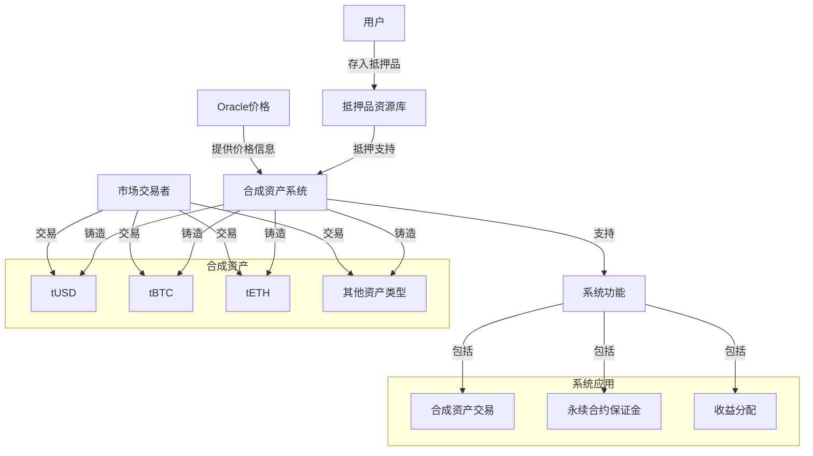
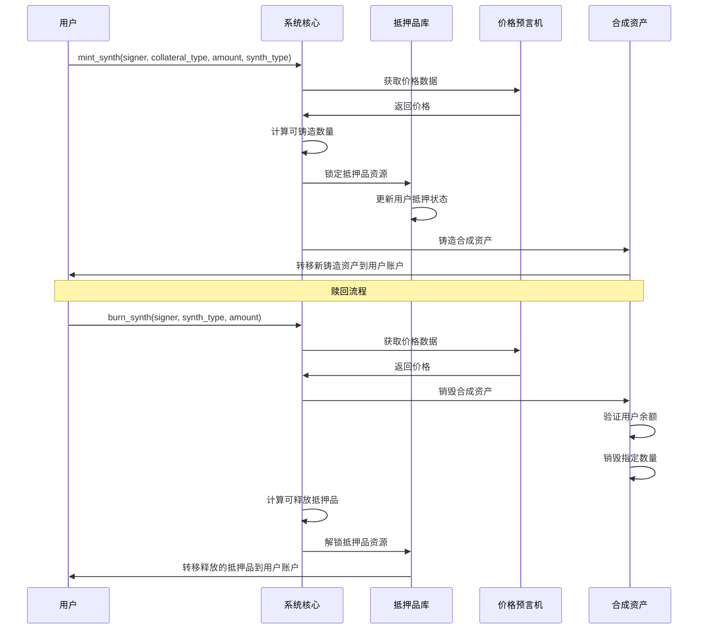

import { Callout, Cards, FileTree, Steps, Tabs } from 'nextra/components'

# Triplex 合成资产系统 - Aptos 版本

<Callout type="info">
  Triplex 的合成资产系统是去中心化金融的核心创新，迁移到 Aptos 区块链后，利用 Move 虚拟机的安全特性，允许用户创建反映各种数字和实物资产价值的代币，无需实际持有底层资产。
</Callout>

## 从以太坊迁移到 Aptos

### 技术对比

| 特性 | Synthetix (以太坊) | Triplex (Aptos) |
|------|-------------------|-----------------|
| **编程语言** | Solidity | Move |
| **虚拟机** | EVM | MoveVM |
| **账户模型** | 合约存储模型 | 资源导向存储模型 |
| **代币标准** | ERC-20 | Fungible Asset |
| **资产结构** | 合约内映射 | 用户账户内资源 |
| **交易确认** | 较慢，费用波动 | 更快，费用稳定 |
| **安全特性** | 需手动防御 | 内置安全保护 |

## 系统架构

### 合成资产系统概览



### 核心组件

<Cards>
  <Cards.Card title="资产核心" href="#核心组件">
    基于 Aptos 资源模型的合成资产架构
  </Cards.Card>
  <Cards.Card title="铸造模块" href="#铸造机制">
    使用 Move 特性创建新合成资产
  </Cards.Card>
  <Cards.Card title="抵押管理" href="#抵押品管理">
    资源导向的抵押品管理系统
  </Cards.Card>
  <Cards.Card title="市场接口" href="#市场机制">
    与 Aptos 生态系统的集成点
  </Cards.Card>
</Cards>

### 系统结构

<FileTree>
  <FileTree.Folder name="Synthetic System" defaultOpen>
    <FileTree.Folder name="Core" defaultOpen>
      <FileTree.File name="synth_core.move" />
      <FileTree.File name="asset_module.move" />
      <FileTree.File name="price_aggregator.move" />
    </FileTree.Folder>
    <FileTree.Folder name="Minting">
      <FileTree.File name="minting_module.move" />
      <FileTree.File name="collateral_manager.move" />
      <FileTree.File name="fee_system.move" />
    </FileTree.Folder>
    <FileTree.Folder name="Markets">
      <FileTree.File name="trading_module.move" />
      <FileTree.File name="liquidity_pool.move" />
      <FileTree.File name="market_state.move" />
    </FileTree.Folder>
  </FileTree.Folder>
</FileTree>

## 合成资产类型

### 基础资产

<Tabs items={['稳定币', '加密资产', '传统资产']}>
  <Tabs.Tab>
    ```move
    module triplex::stable_synth {
        use std::error;
        use std::signer;
        use aptos_framework::fungible_asset::{Self, FungibleAsset};
        
        struct StableSynth has key {
            mint_cap: fungible_asset::MintCapability,
            burn_cap: fungible_asset::BurnCapability,
        }
        
        public fun mint(
            account: &signer,
            amount: u64,
            collateral_type: vector<u8>
        ): FungibleAsset acquires StableSynth {
            // 铸造逻辑实现
            // ...
        }
        
        public fun burn(
            account: &signer,
            synth_asset: FungibleAsset
        ): u64 acquires StableSynth {
            // 销毁逻辑实现
            // ...
        }
        
        public fun get_collateral_ratio(collateral_type: vector<u8>): u64 {
            // 获取抵押率逻辑
            // ...
        }
    }
    ```
  </Tabs.Tab>
  
  <Tabs.Tab>
    <Cards>
      <Cards.Card title="比特币" href="#基础资产">
        BTC价格追踪合成资产
      </Cards.Card>
      <Cards.Card title="以太坊" href="#基础资产">
        ETH价格追踪合成资产
      </Cards.Card>
      <Cards.Card title="其他" href="#基础资产">
        多种加密货币合成资产
      </Cards.Card>
    </Cards>
  </Tabs.Tab>
  
  <Tabs.Tab>
    <Steps>
      1. **股票合成资产**
         - 股票指数
         - 个股代币
         - ETF映射
      
      2. **商品合成资产**
         - 贵金属
         - 能源产品
         - 农产品
    </Steps>
  </Tabs.Tab>
</Tabs>

## 铸造机制

### 铸造与赎回流程



### 铸造流程

<Steps>
  1. **抵押品存入**
     - 选择抵押品类型
     - 确定存入数量
     - 验证抵押率 (基于 Move 类型系统验证)
  
  2. **铸造计算**
     - 获取价格数据
     - 计算可铸造量
     - 应用铸造费用
  
  3. **资产铸造**
     - 锁定抵押品资源
     - 生成合成资产
     - 更新账户资源状态
</Steps>

### 多抵押品策略

<Cards>
  <Cards.Card title="标准铸造" href="#多抵押品策略">
    单一资产抵押方式
  </Cards.Card>
  <Cards.Card title="混合抵押" href="#多抵押品策略">
    多资产组合抵押方式
  </Cards.Card>
  <Cards.Card title="动态调整" href="#多抵押品策略">
    根据市场情况调整比例
  </Cards.Card>
  <Cards.Card title="优化策略" href="#多抵押品策略">
    基于 Move VM 特性最大化资本效率
  </Cards.Card>
</Cards>

## 抵押品管理

### 支持资产

<Tabs items={['核心资产', '稳定币', '收益资产']}>
  <Tabs.Tab>
    <Cards>
      <Cards.Card title="Aptos (APT)" href="#支持资产">
        Aptos 原生代币
      </Cards.Card>
      <Cards.Card title="wBTC" href="#支持资产">
        Aptos 上的包装比特币
      </Cards.Card>
      <Cards.Card title="质押资产" href="#支持资产">
        质押型衍生品
      </Cards.Card>
    </Cards>
  </Tabs.Tab>
  
  <Tabs.Tab>
    <Steps>
      1. **中心化稳定币**
         - USDC
         - USDT
         - BUSD
      
      2. **去中心化稳定币**
         - DAI
         - LUSD
         - sUSD
    </Steps>
  </Tabs.Tab>
  
  <Tabs.Tab>
    <Cards>
      <Cards.Card title="LP代币" href="#支持资产">
        Aptos 生态流动性提供者代币
      </Cards.Card>
      <Cards.Card title="收益代币" href="#支持资产">
        收益聚合代币
      </Cards.Card>
      <Cards.Card title="质押代币" href="#支持资产">
        治理质押代币
      </Cards.Card>
    </Cards>
  </Tabs.Tab>
</Tabs>

### 风险管理

<Callout type="warning">
  抵押品管理系统利用 Aptos 的资源模型，实现更安全的风险控制措施，包括动态抵押率、清算机制和紧急处理流程，确保系统的安全性和稳定性。
</Callout>

#### Move 资源型抵押模型

```move
module triplex::collateral_manager {
    use std::signer;
    use aptos_framework::fungible_asset::{Self, FungibleAsset};
    
    struct CollateralPosition has key {
        collateral_type: vector<u8>,
        amount: u64,
        synth_value: u64,
        last_update: u64,
    }
    
    struct CollateralConfig has key {
        min_ratio: u64,  // 最小抵押率，例如 150% = 1500000
        liquidation_ratio: u64,  // 清算阈值
        liquidation_penalty: u64,  // 清算惩罚
    }
    
    // 存入抵押品
    public fun deposit_collateral(
        account: &signer,
        collateral: FungibleAsset
    ) acquires CollateralPosition {
        // 实现逻辑
    }
    
    // 提取抵押品
    public fun withdraw_collateral(
        account: &signer,
        amount: u64
    ): FungibleAsset acquires CollateralPosition {
        // 实现逻辑
    }
    
    // 清算不足抵押的头寸
    public fun liquidate_position(
        liquidator: &signer,
        target_account_addr: address
    ): FungibleAsset acquires CollateralPosition {
        // 实现逻辑
    }
}
```

## 市场机制

### 交易支持

<Steps>
  1. **现货交易**
     - 基于 Aptos 的高性能交易系统
     - 低延迟订单匹配
     - 资源导向的流动性池
  
  2. **衍生品基础**
     - 永续合约的 Move 实现
     - 期权合约系统
     - 基于 Move 类型系统的结构化产品
  
  3. **收益机制**
     - 交易费用分配
     - 铸造费用系统
     - 清算奖励机制
</Steps>

### 价格机制

<Tabs items={['价格发现', '预言机集成', '风险控制']}>
  <Tabs.Tab>
    ```move
    module triplex::price_aggregator {
        use aptos_framework::timestamp;
        
        struct PriceData has key {
            price: u64,
            timestamp: u64,
            source_count: u8,
            deviation: u64,
        }
        
        struct PriceConfig has key {
            max_delay: u64,  // 最大允许延迟（秒）
            max_deviation: u64,  // 最大允许偏差
            min_sources: u8,  // 最小数据源数量
        }
        
        // 获取资产价格
        public fun get_price(asset_id: vector<u8>): (u64, u64) acquires PriceData {
            // 实现逻辑
            // 返回(价格, 时间戳)
        }
        
        // 验证价格有效性
        public fun validate_price(
            asset_id: vector<u8>,
            price: u64,
            timestamp_value: u64
        ): bool acquires PriceConfig, PriceData {
            // 实现逻辑
        }
        
        // 更新价格数据（由预言机调用）
        public fun update_price(
            oracle: &signer,
            asset_id: vector<u8>,
            price: u64
        ) acquires PriceData {
            // 实现逻辑
        }
    }
    ```
  </Tabs.Tab>
  
  <Tabs.Tab>
    <Cards>
      <Cards.Card title="数据源" href="#数据源">
        多样化价格提供者
      </Cards.Card>
      <Cards.Card title="聚合机制" href="#聚合机制">
        价格数据处理方法
      </Cards.Card>
      <Cards.Card title="更新策略" href="#更新策略">
        Move交易的价格数据更新机制
      </Cards.Card>
    </Cards>
  </Tabs.Tab>
  
  <Tabs.Tab>
    <Steps>
      1. **价格保护**
         - Move VM 类型安全的偏差检测
         - 基于时间戳的延迟机制
         - 阈值限制
      
      2. **应急措施**
         - 价格冻结
         - 交易暂停
         - 系统降级
    </Steps>
  </Tabs.Tab>
</Tabs>

## 安全增强

### Aptos 平台安全优势

<Cards>
  <Cards.Card title="资源不可复制" href="#安全增强">
    防止合成资产的意外或恶意复制
  </Cards.Card>
  <Cards.Card title="所有权验证" href="#安全增强">
    确保只有资产所有者能够操作资产
  </Cards.Card>
  <Cards.Card title="形式化验证" href="#安全增强">
    使用 Move Prover 进行形式化验证
  </Cards.Card>
  <Cards.Card title="静态分析" href="#安全增强">
    减少运行时错误和漏洞
  </Cards.Card>
</Cards>

### 从Synthetix迁移的主要变化

<Callout type="info">
  从以太坊迁移到Aptos的过程中，Triplex系统重构了以下核心组件以适应Move的资源模型和类型系统：
</Callout>

<Steps>
  1. **资源导向设计**
     - 合成资产表示为账户内资源
     - 抵押品作为资源进行管理
     - 市场状态以资源方式存储
  
  2. **静态调用替代动态调度**
     - 从Solidity的动态调度改为Move的静态调度
     - 提高安全性和性能
     - 减少运行时错误
  
  3. **并行执行优化**
     - 利用Aptos的并行执行能力
     - 改进交易吞吐量
     - 提高系统响应速度
</Steps>
