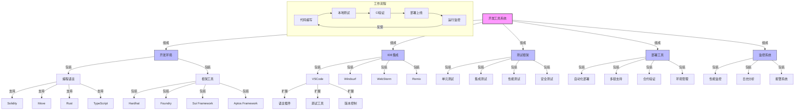

import { Callout, Cards, FileTree, Steps, Tabs } from 'nextra/components'

# Triplex 工具系统

<Callout type="info">
  Triplex 提供了完整的开发工具链和工作流程支持，包括开发环境设置、IDE 集成、测试框架和部署工具，以确保高效的开发和运维过程。
</Callout>

## 开发环境

### 开发工具链架构图



### 基础工具链

<Cards>
  <Cards.Card title="编程语言" href="#编程语言">
    Move、Solidity、Rust
  </Cards.Card>
  <Cards.Card title="开发框架" href="#开发框架">
    Aptos Framework、Sui Framework
  </Cards.Card>
  <Cards.Card title="测试工具" href="#测试工具">
    单元测试、集成测试、模拟测试
  </Cards.Card>
  <Cards.Card title="部署工具" href="#部署工具">
    自动化部署、环境管理、配置工具
  </Cards.Card>
</Cards>

### 环境配置

<Tabs items={['Solidity 环境', 'Move 环境', 'TypeScript 环境']}>
  <Tabs.Tab>
    <Steps>
      1. **Node.js 安装**
         - 使用 nvm 管理版本
         - 安装 Node.js LTS
         - 配置 npm 源
      
      2. **开发框架**
         - 安装 Hardhat
         - 配置 Foundry
         - 设置编译器
    </Steps>
  </Tabs.Tab>
  
  <Tabs.Tab>
    ```bash
    # 安装 Rust
    curl --proto '=https' --tlsv1.2 -sSf https://sh.rustup.rs | sh
    
    # 安装 Sui CLI
    cargo install --locked --git https://github.com/MystenLabs/sui.git sui
    
    # 安装语言分析器
    cargo install --git https://github.com/move-language/move move-analyzer
    
    # 创建项目
    sui move new project_name
    ```
  </Tabs.Tab>
  
  <Tabs.Tab>
    <Cards>
      <Cards.Card title="依赖管理" href="#依赖管理">
        包管理、版本控制、依赖解析
      </Cards.Card>
      <Cards.Card title="开发工具" href="#开发工具">
        IDE插件、代码生成、调试工具
      </Cards.Card>
      <Cards.Card title="测试框架" href="#测试框架">
        Move测试、Rust测试、自动化测试
      </Cards.Card>
    </Cards>
  </Tabs.Tab>
</Tabs>

## IDE 集成

### 开发工具

<Cards>
  <Cards.Card title="VSCode" href="#vscode">
    Move语言插件、语法高亮、智能提示
  </Cards.Card>
  <Cards.Card title="Windsurf" href="#windsurf">
    Sui专用IDE、项目管理、自动编译
  </Cards.Card>
  <Cards.Card title="WebStorm" href="#webstorm">
    前端开发、智能补全、调试工具
  </Cards.Card>
  <Cards.Card title="Remix" href="#remix">
    智能合约IDE、在线编译、测试环境
  </Cards.Card>
</Cards>

### 扩展配置

<Tabs items={['Solidity', 'Move', 'TypeScript']}>
  <Tabs.Tab>
    <FileTree>
      <FileTree.Folder name="VSCode Extensions" defaultOpen>
        <FileTree.File name="solidity.solidity" />
        <FileTree.File name="juanblanco.solidity" />
        <FileTree.File name="tintinweb.solidity-visual-auditor" />
      </FileTree.Folder>
    </FileTree>
  </Tabs.Tab>
  
  <Tabs.Tab>
    <Steps>
      1. **Move 扩展**
         - Move Analyzer
         - Sui Move Analyzer
         - Move Syntax
         - Move MSL Syntax
      
      2. **配置设置**
         - 语言服务器路径
         - 语法高亮
         - 代码格式化
    </Steps>
  </Tabs.Tab>
  
  <Tabs.Tab>
    <Cards>
      <Cards.Card title="TypeScript" href="#typescript">
        类型检查、接口定义、代码组织
      </Cards.Card>
      <Cards.Card title="ESLint" href="#eslint">
        代码风格、错误检测、最佳实践
      </Cards.Card>
      <Cards.Card title="Prettier" href="#prettier">
        格式化规则、一致风格、版本控制
      </Cards.Card>
    </Cards>
  </Tabs.Tab>
</Tabs>

## 测试框架

### 测试类型

<Cards>
  <Cards.Card title="单元测试" href="#单元测试">
    Move测试框架、模块验证、功能测试
  </Cards.Card>
  <Cards.Card title="集成测试" href="#集成测试">
    跨模块测试、系统集成、流程验证
  </Cards.Card>
  <Cards.Card title="性能测试" href="#性能测试">
    基准测试、负载测试、压力测试
  </Cards.Card>
  <Cards.Card title="安全测试" href="#安全测试">
    漏洞扫描、渗透测试、形式化验证
  </Cards.Card>
</Cards>

### 测试工具

<Tabs items={['合约测试', 'API 测试', '自动化测试']}>
  <Tabs.Tab>
    ```solidity
    // 测试合约示例
    contract TestExample {
        function testDeposit() public {
            // 准备测试数据
            uint256 amount = 100;
            address user = address(1);
            
            // 执行测试
            vm.prank(user);
            vault.deposit(amount);
            
            // 验证结果
            assertEq(
                vault.balanceOf(user),
                amount,
                "Deposit failed"
            );
        }
    }
    ```
  </Tabs.Tab>
  
  <Tabs.Tab>
    <Steps>
      1. **接口测试**
         - 请求验证
         - 响应检查
         - 状态确认
      
      2. **集成测试**
         - 流程验证
         - 数据一致性
         - 异常处理
    </Steps>
  </Tabs.Tab>
  
  <Tabs.Tab>
    <Cards>
      <Cards.Card title="CI/CD" href="#ci-cd">
        自动化构建、持续集成、部署流水线
      </Cards.Card>
      <Cards.Card title="监控工具" href="#监控工具">
        性能监控、日志收集、警报系统
      </Cards.Card>
      <Cards.Card title="报告生成" href="#报告生成">
        测试报告、覆盖率统计、性能分析
      </Cards.Card>
    </Cards>
  </Tabs.Tab>
</Tabs>

## 部署工具

### 部署流程

<Steps>
  1. **环境准备**
     - 网络选择
     - 配置验证
     - 密钥管理
  
  2. **合约部署**
     - 编译验证
     - 部署执行
     - 地址记录
  
  3. **合约验证**
     - 代码验证
     - 功能测试
     - 安全检查
  
  4. **监控维护**
     - 状态监控
     - 升级管理
     - 问题处理
</Steps>

### 多链支持

<Tabs items={['以太坊', 'Layer2', '其他公链']}>
  <Tabs.Tab>
    <Cards>
      <Cards.Card title="主网部署" href="#主网部署">
        升级策略、风险控制、验证过程
      </Cards.Card>
      <Cards.Card title="测试网络" href="#测试网络">
        预发布环境、功能验证、兼容性测试
      </Cards.Card>
      <Cards.Card title="本地网络" href="#本地网络">
        开发环境、快速测试、调试支持
      </Cards.Card>
    </Cards>
  </Tabs.Tab>
  
  <Tabs.Tab>
    <Steps>
      1. **Optimism**
         - OVM 兼容性
         - 跨层交互
         - 状态同步
      
      2. **Arbitrum**
         - Nitro 支持
         - 交易验证
         - 数据可用性
    </Steps>
  </Tabs.Tab>
  
  <Tabs.Tab>
    <Cards>
      <Cards.Card title="BSC" href="#bsc">
        智能合约适配、跨链桥接、资产管理
      </Cards.Card>
      <Cards.Card title="Polygon" href="#polygon">
        扩展性方案、低成本交易、高TPS处理
      </Cards.Card>
      <Cards.Card title="Avalanche" href="#avalanche">
        子网部署、共识适配、跨链资产
      </Cards.Card>
    </Cards>
  </Tabs.Tab>
</Tabs>

## 监控工具

### 监控指标

<Cards>
  <Cards.Card title="链上数据" href="#链上数据">
    交易监控、区块分析、合约活动
  </Cards.Card>
  <Cards.Card title="性能指标" href="#性能指标">
    处理延迟、吞吐量、资源利用
  </Cards.Card>
  <Cards.Card title="业务指标" href="#业务指标">
    用户活动、交易量、价值捕获
  </Cards.Card>
  <Cards.Card title="安全指标" href="#安全指标">
    事件监控、风险评估、漏洞分析
  </Cards.Card>
</Cards>

### 工具集成

<Tabs items={['监控平台', '告警系统', '分析工具']}>
  <Tabs.Tab>
    <Steps>
      1. **数据采集**
         - 事件监听
         - 指标收集
         - 日志记录
      
      2. **数据处理**
         - 实时分析
         - 趋势计算
         - 报告生成
    </Steps>
  </Tabs.Tab>
  
  <Tabs.Tab>
    <Cards>
      <Cards.Card title="告警规则" href="#告警规则">
        阈值设置、优先级分级、触发条件
      </Cards.Card>
      <Cards.Card title="通知渠道" href="#通知渠道">
        邮件通知、即时消息、语音提醒
      </Cards.Card>
      <Cards.Card title="响应流程" href="#响应流程">
        紧急处理、升级流程、事后分析
      </Cards.Card>
    </Cards>
  </Tabs.Tab>
  
  <Tabs.Tab>
    <Steps>
      1. **数据分析**
         - 模式识别
         - 异常检测
         - 性能分析
      
      2. **优化建议**
         - 性能优化
         - 成本降低
         - 安全加强
    </Steps>
  </Tabs.Tab>
</Tabs> 