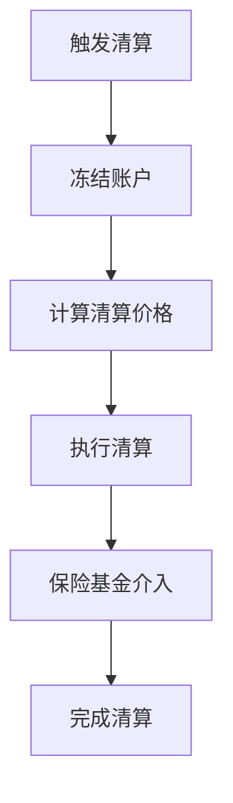

# 协议机制

## 交易机制

### 永续合约基础
永续合约是一种没有到期日的衍生品合约，通过资金费率机制将合约价格锚定到现货价格。

### 价格形成
- 标记价格（Mark Price）
- 指数价格（Index Price）
- 公平价格（Fair Price）
- 预估清算价格（Estimated Liquidation Price）

### 订单类型
1. **限价单**
   - 指定价格和数量
   - 可选择成交策略
   - 支持 Post-only

2. **市价单**
   - 立即成交
   - 滑点保护
   - 最优价格执行

3. **条件单**
   - 止盈止损
   - 跟踪止损
   - 冰山订单

## 资金费率

### 计算公式
资金费率 = 基础利率 + 溢价系数 × (长仓规模 - 空仓规模) / 总持仓规模

### 结算周期
- 每8小时结算一次
- 实时预估费率展示
- 自动化结算流程

### 费率上限
- 最大正费率：0.375%
- 最大负费率：-0.375%
- 动态调节机制

## 保证金系统

### 初始保证金
- 最低要求：2%
- 根据杠杆倍数调整
- 分层保证金要求

### 维持保证金
- 最低要求：1%
- 动态调整机制
- 风险等级划分

### 追加保证金
- 预警机制
- 自动追加流程
- 手动追加选项

## 清算机制

### 触发条件
1. 账户权益低于维持保证金
2. 市场剧烈波动
3. 系统风险预警

### 清算流程

### 保险基金
- 资金来源
- 使用规则
- 补充机制

## 流动性机制

### AMM模型
- 恒定乘积公式
- 动态价格曲线
- 滑点计算

### 流动性提供
- LP代币机制
- 收益分配
- 风险控制

### 深度管理
- 多层级流动性池
- 动态调整机制
- 激励机制

## 预言机系统

### 价格源
- 链上预言机
- 交易所API
- 去中心化预言机网络

### 价格更新
- 更新频率
- 延迟处理
- 异常检测

### 故障保护
- 备用价格源
- 价格偏离保护
- 紧急暂停机制

## 手续费机制

### 费用类型
1. **交易手续费**
   - 开仓费用
   - 平仓费用
   - 手续费折扣

2. **其他费用**
   - 提现费用
   - 清算费用
   - 协议费用

### 费用分配
- 流动性提供者
- 保险基金
- 协议国库

## 治理机制

### 参数调整
- 资金费率参数
- 保证金要求
- 手续费率

### 紧急处理
- 交易暂停
- 强制清算
- 紧急升级

### 升级机制
- 提案流程
- 投票机制
- 执行时间表 