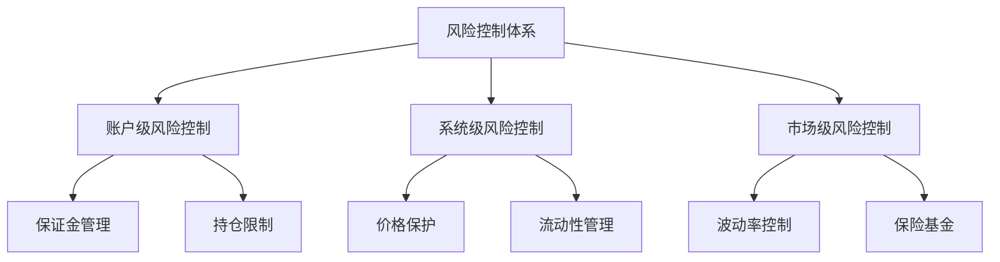

# 风险管理

## 风险控制体系

### 多层级风险防护

## 账户风险管理

### 保证金系统
1. **初始保证金要求**
   - 基础保证金率
   - 动态调整机制
   - 分层保证金要求

2. **维持保证金要求**
   - 最低维持保证金
   - 风险等级划分
   - 预警机制

3. **追加保证金流程**
   - 预警通知
   - 追加时限
   - 自动追加选项

### 持仓限制
- 单个账户最大持仓
- 单个市场最大持仓
- 杠杆倍数限制

## 清算机制

### 清算触发条件
- 账户权益低于维持保证金
- 市场剧烈波动
- 系统风险预警

### 清算流程
1. 风险预警
2. 账户冻结
3. 清算价格计算
4. 仓位平仓
5. 保证金处理
6. 清算完成确认

### 部分清算
- 触发条件
- 执行优先级
- 保证金分配

## 价格保护机制

### 价格来源
- 多源价格聚合
- 异常值过滤
- 权重动态调整

### 价格更新
- 实时更新机制
- 延迟保护
- 备份方案

### 价格偏离保护
- 最大偏离限制
- 自动暂停机制
- 恢复流程

## 流动性风险管理

### 流动性监控
- 实时深度监控
- 流动性预警
- 自动干预机制

### 流动性提供者管理
- LP资质要求
- 风险限制
- 激励机制

### 紧急流动性方案
- 备用流动性池
- 紧急流动性提供
- 市场干预机制

## 系统风险控制

### 交易限制
- 最大订单规模
- 价格波动限制
- 交易频率限制

### 系统容量管理
- 订单队列管理
- 系统负载监控
- 自动扩容机制

### 紧急响应
- 交易暂停触发
- 系统降级方案
- 恢复流程

## 保险基金

### 基金管理
- 资金来源
- 使用规则
- 规模管理

### 动态调整
- 风险评估
- 费率调整
- 补充机制

### 使用流程
- 触发条件
- 资金分配
- 记录追踪

## 风险监控系统

### 实时监控
- 关键指标监控
- 异常检测
- 预警系统

### 风险报告
- 日常风险报告
- 事件分析
- 改进建议

### 应急预案
- 预案分级
- 响应流程
- 恢复机制

## 治理与升级

### 风险参数治理
- 参数调整流程
- 社区投票
- 实施时间表

### 系统升级
- 升级提案
- 安全审计
- 分步实施

### 紧急处理
- 紧急委员会
- 快速决策机制
- 后续追踪 